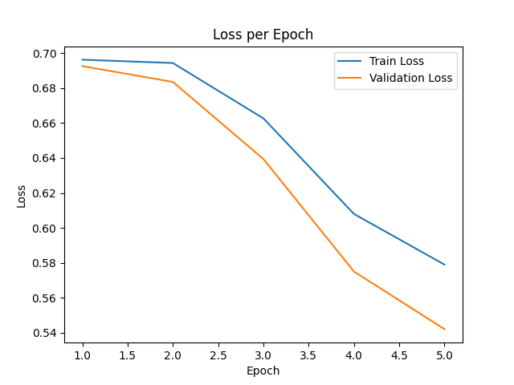
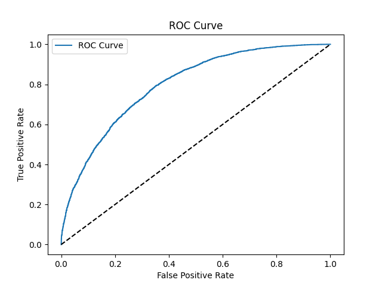

# Анализ тональности отзывов IMDB с помощью BERT
Основная цель этого проекта - разработка модели **бинарной классификации тональности** (позитивная vs негативная) с использованием **набора данных отзывов на фильмы IMDB** [dataset](https://ai.stanford.edu/~amaas/data/sentiment/). В проекте используется архитектура модели на основе **BERT** для классификации того, является ли данный киноотзыв **Хорошим** (позитивная тональность) или **Плохим** (негативная тональность).

## Loss Plot

## ROC AUC CURVE (НАИЛУЧШАЯ)

## Dataset
В проекте используется набор данных IMDB:
- 50 000 отзывов, разделенных на обучающую (25 000) и тестовую (25 000) выборки
- Каждый отзыв помечен как позитивный (метка = 1) или негативный (метка = 0)
- В директории `aclImdb/` папка `pos/` содержит позитивные отзывы, а `neg/` — негативные
- Папка `unsup/` игнорируется, так как она содержит данные без меток

## Архитектура модели
В проекте используется модель BERT для классификации тональности.
- Объединённый выходной слой BERT (`outputs.pooler_output`) пропускается через слой dropout, а затем через линейный слой (`sentiment_classifier`) с размерностью выхода = 2 (для двух классов)
- Прямой проход (Forward Method) возвращает только логиты (сырые оценки) тональности

## Метрики оценки
- **Loss (Функция потерь)**: Стандартная перекрёстная энтропия
- **F1-Score (взвешенный)**: Оценивает качество классификации
- **ROC-AUC**: Измеряет способность модели разделять положительный и отрицательный классы

## Лучший результат
- Эпоха: 5
- val_f1: 0.718965871977108
- val_roc_auc: 0.79667576

## Инференс
Скрипт [predict.py](/predict.py):
- Загружает обученную модель BERT (чекпоинт `.pth`) из папки **checkpoints/**
- Токенизирует входной текст отзыва с помощью BertTokenizer
- Выполняет прямой проход по модели для получения логитов тональности
- Выводит результат классификации: «Хорошо» или «Плохо», а также их вероятности

